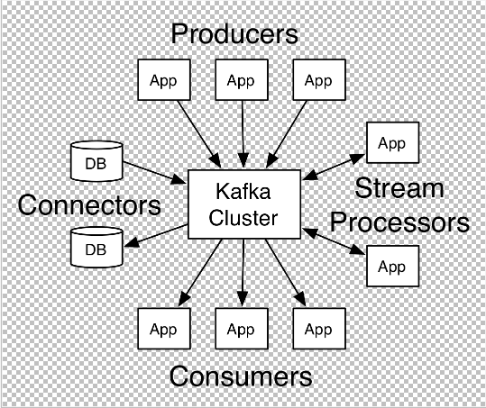
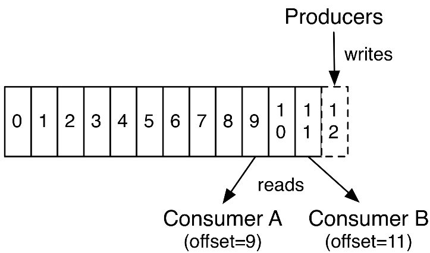
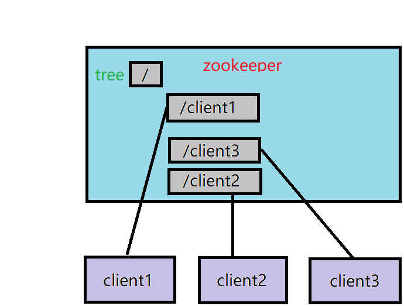

# [Welcome to 95hx kafka tutorial](https://github.com/95hx/kafka-demo) 

### _**apis**_

#### 特点

* _**producer:发布一个消息到多个topic**_
* _**consumer:消费一个或流式的消息**_
* _**connector:捕获每一个改变,从topic存取消息**_
* _**stream processors:流式处理多个topic的消息,更有效的输入输出流转换**_

### _**log_anatomy**_

#### 特点

* _**抽象的流record分类**_
* _**硬盘的存取速度约等于内存**_
* _**队列形式的消息持久化**_
* _**便捷的横向扩展与主从备份**_

### _**consumer-groups**_

#### 特点

* _**同一partition的顺序保证**_
* _**同一消费组对partition异步的读取**_
* _**伸缩性的消费者集群**_
* _**消费者死亡时的任务转移**_
* _**广播或者组形式的消费**_
* _**故障容忍最多可达N-1服务器**_
* _**在一个使用者组中不能有比分区更多的使用者实例**_

### _**log_consumer**_

#### 特点

* _**每个记录由一个键、一个值和一个时间戳组成**_
* _**偏移量惟一地标识分区中的每个记录**_
* _**follower被动地复制了leader**_
* _**支持生产者确认发送成功**_
* _**不同磁盘结构相同出色的表现**_
* _**低延时流水线式的多功能消息驱动**_

### _**zookeeper_register_center**_

#### 功能

 - 实现共享变量,同步配置等通信问题
* _**最终一致性**_
* _**可靠性**_
* _**实时性**_
* _**等待无关**_
* _**原子性**_
* _**顺序性**_

