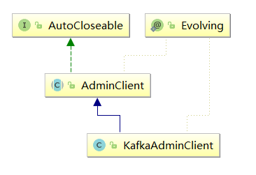

# kafkaAdminClient 
#### 用来获取kafka集群服务器信息

* AclOperation 访问控制
* ClientRequest 封装了客户端发送元数据到服务端的请求
* ClientResponse 来自服务器的响应 包含响应的主体以及相关请求
* Metadata 用于主题管理 线程共享的元数据
* NetworkClient 封装了客户端发送元数据到服务端的请求
* KafkaFuture 异步获取结果
* Cluster 集群中节点、主题和分区的子集的信息
*          String clusterId,
*          Collection<Node> nodes,
*          Collection<PartitionInfo> partitions,
*          Set<String> unauthorizedTopics,
*          Set<String> internalTopics
* Node 连接节点信息
*            int id, 
*            String host,
*            int port, 
*            String rack
* PartitionInfo 元数据响应中的每个分区状态信息
*            String topic, 
*            int partition, 
*            Node leader,
*            Node[] replicas, 
*            Node[] inSyncReplicas, 
*            Node[] offlineReplicas
